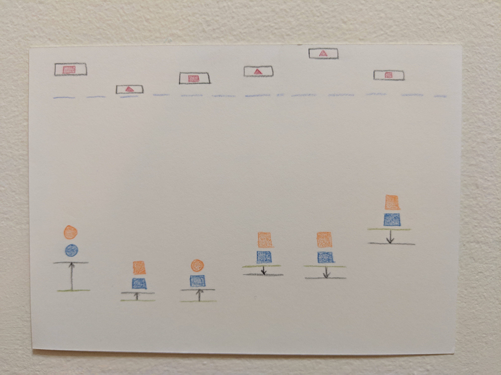
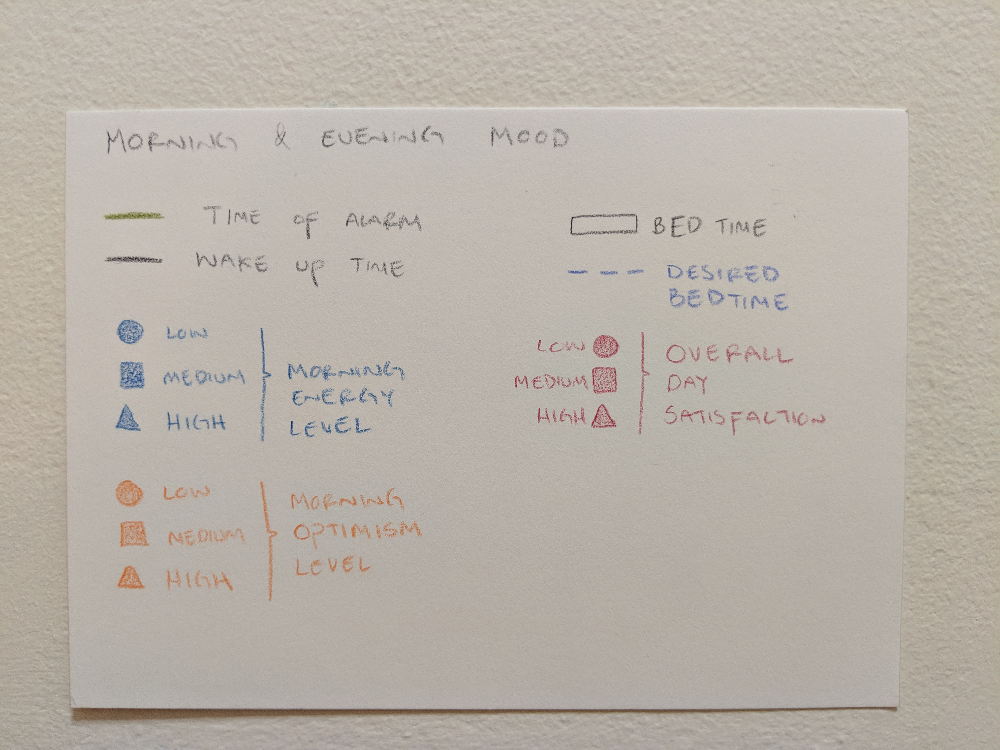

DAVID AZAR | davidazar.mx  
QUANT HUMANISTS  
SPRING 2019  
11 02 2019 

# Assignment `#2`: Dear Data

One-week self tracking and visualization on non-digital means

## What to track about myself

Self tracking is an interesting habit. It is one of the most personal activities we can do, it is entirely under our control, and the insights are valid only for ourselves.

I struggle a lot with waking up and going to bed at a reasonable hour. Nights are great for me to work because the world is quiet. However, the price to pay is usually having a crappy morning and a rough start of the day.

To gain more knowledge about the state I wake up on, I decided to self-track a few key aspects of my morning and nights.

###**The aspect to track were the following:**
 
####***Mornings***
* Time of alarm
* Time of getting out of bed
* Energy level
* How rested I feel (not the same as energy level)
* Level of optimism for the day ahead
* Number of snoozes
* Went back to sleep between snoozes?
* First thing I did when waking up

####***Nights***
* Overall satisfaction with the day
* Bedtime

---

## Results

**Front** - Visualization

**Back** - Legend

As you can see from the visualization, not every parameter that was tracked made it. This is mainly because I felt like the ones that did get represented made the most sense together.

*Interestingly enough, the first thing I did all last week when waking up was checking my Instagram, some that makes me very angry.*

 
The "Dear Data" project that inspired this activity is very impressive because of its perseverant nature and the beautiful visual representations of the miscellaneous data the artists collected over the span of a year.

 

I honestly loved this exercise. I enjoyed tracking something mundane about my life and having to choose a creative method for representing that data. I specially enjoyed doing that on a piece of paper rather that on a computer.