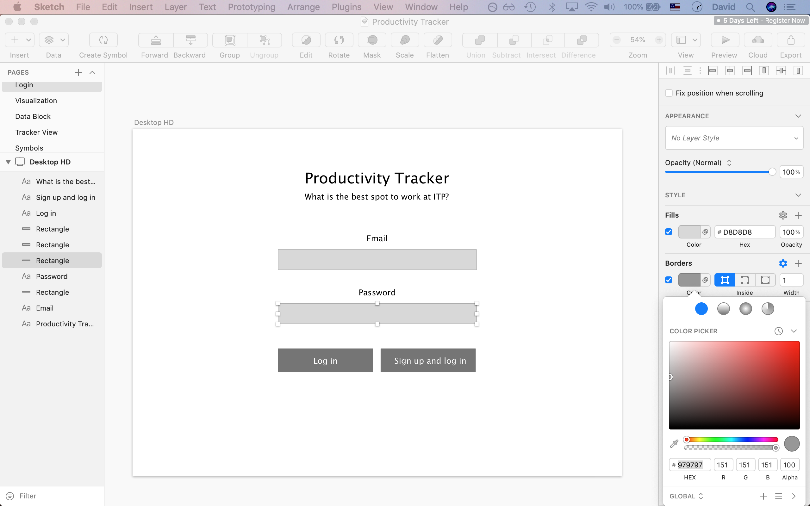
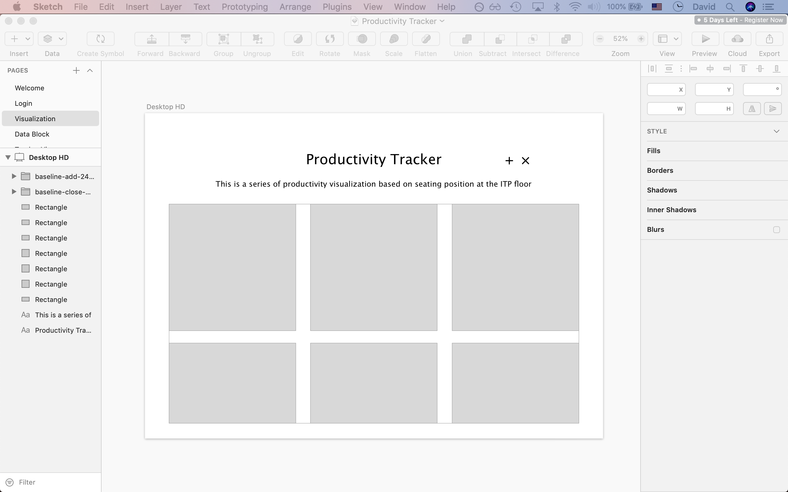
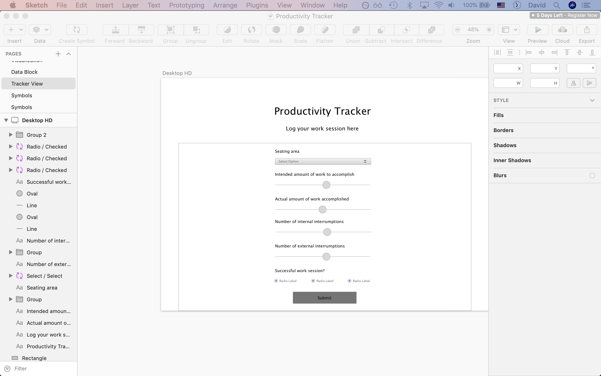
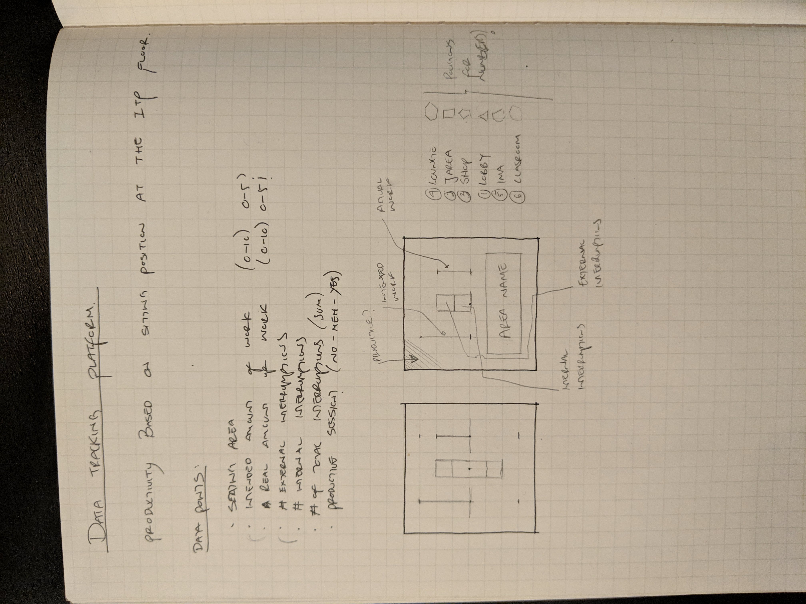
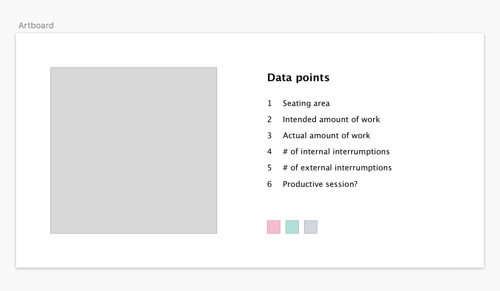
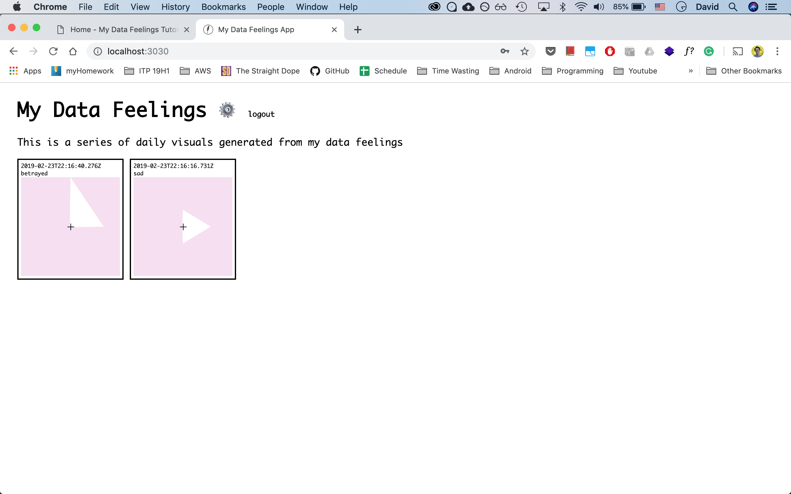
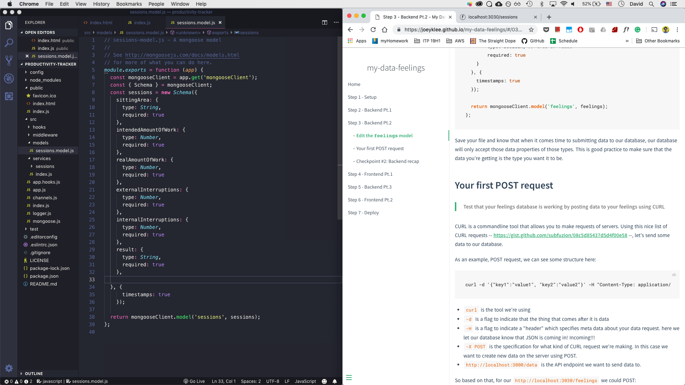
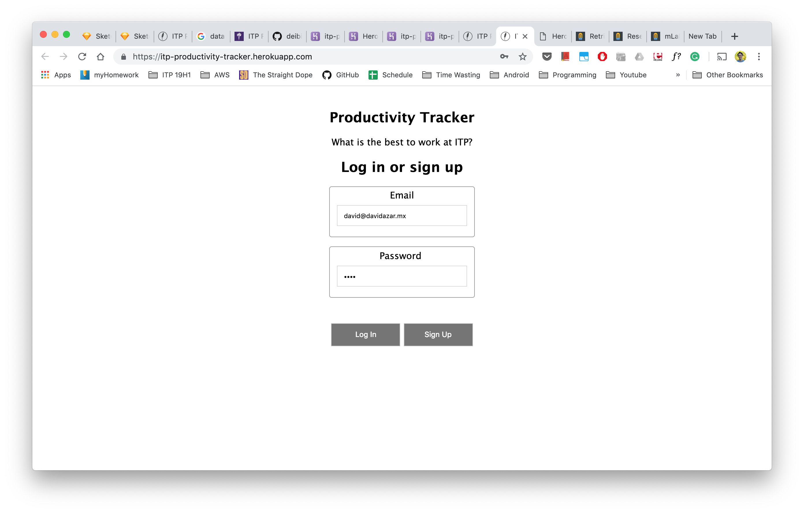
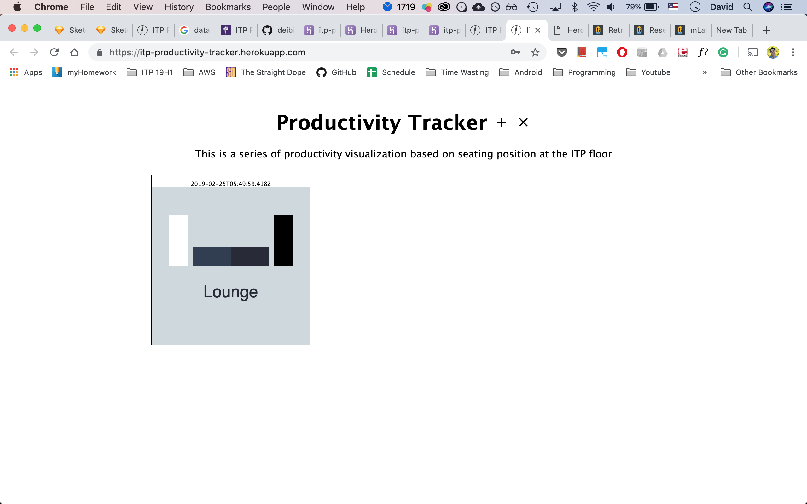
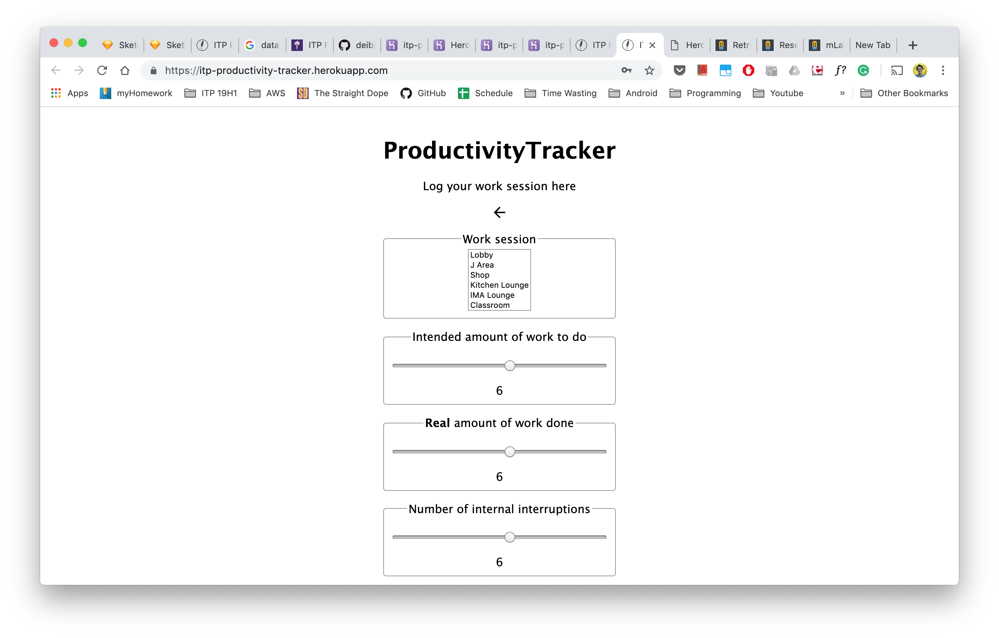

DAVID, AZAR  
QUANT HUMANISTS  
SPRING 2019   
25 02 2019

## Assignment `3`: ITP Productivity Tracker [Live app](https://itp-productivity-tracker.herokuapp.com/)
 

This is an online platform to track work productivity based on where you sit at the ITP floor.

### Before we start

This assignment is a big challenge to me for a number of reasons:

* While I have a lot of programming experienced, I've never coded a full-stack app.
* There is front-end design and data viz elements to it.
* I have to find a relevant aspect of my own personal life to collect.
* Deployment is scary.

Let's go.

__*Disclaimer:*__ I am trying a new thing where I write a blog post as I develop a concept, instead of writing when having the finished thing. Due to this, a messy and much more verbose story is told. Something that I intended to make at the beginning might not be included in the final result. Consequently, all of the process is included here and it follows a narrative that expresses my exact process. 

---

### Developing the concept

Before even starting to draft an idea of the thing I want to make, I will take a look into the my-feelings-app that Joey created as an example.

The app is very impressive. Simple but very complete. I know we have the option to just modify the data model, but this feels like the opportunity to learn full-stack development that I've been waiting for in a long time, so I'll make the app from scratch.

### Brief analysis of the current app

As far as I can see, the app consists of three main views:

1. Login view.
2. Dashboard. (visualization)
3. Tracking view.

Transitions are made by showing and hiding the respective views, all according the events (button clicks, etc). There is no use of the URL to route views or pass data between them.

I like this style of view and state handling.

### My personal data collection and visualization platform

Now that I've seen a good example of what's possible, it's my turn to make my own.
But, what should I track?

* What do I care about?
* What is a thing about my life and personality that I'd like to get some clarity on?
* Are there any aspects of my work/school life that I'd like to put down into numbers?

Some loose ideas come to mind:

1. An app that tracks my mood and cross-references it with weather data to see if rainy or cloudy days affect my feelings in some way.
2. An app that tracks how much time I spend at school/house/outside and cross-reference it with my mood.
3. An app that tracks my productivity in terms of where I sit to work on the ITP floor (my favourite one so far).
4. An app that helps me track how often I get distracted and with what. (recurrent theme here).
5. An app that tracks intrusive thoughts. (too personal maybe?)

I feel like doing idea #3 because it is the most relevant, and if done correctly, it's going to help track my real productivity.

---

## Productivity-tracking tool based on sitting area on the ITP floor

Ok, the idea is solid. But, what are the key elements I need to care about in order to make this a useful thing?

### Design

#### Data points

Following are the data points that seem relevant for this app:

* Sitting area (list of options)
* Intended amount of work to accomplish (slider from 1-10)
* Amount of work actually accomplished (slider from 0-10)
* Number of external interruptions (somebody talking to you, etc). (slider from 1-10)
* Number of internal interruptions (break, bathroom, etc).(slider from 1-10)
* Number of interruptions (slider from 0-10). (Sum of previous options).
* Feel like a successful session? (yes/no)

Maybe some of the previous data points don't make it to the end, but those are the ones that feel the most relevant so far.

#### User actions

Borrowing from Joey's app, the actions will be the following:

* Login/sign up
* Submit a record
* Visualize the data
* Log out
* *Filter???* – (maybe, if there is time)

#### UI Design

After defining the necessary data to show and collect, as well as the user actions, I can move on to design.

I usually use Keynote to draft UI ideas. I've always wanted to learn industry standard tools for UI/UX design, so I'm going to draft a simple UI with Sketch.

I will not focus on making the most beautiful interface ever created, but rather a functional one that hopefully does not look bad.

I am very limited in what I can accomplish using Sketch. However, I feel like this interface gets the point across.

I spent about an hour doing the UI. I didn't want to spend more on it because the focus of this assignment lies somewhere else.

The visualization blocks will look something like this:

Some experimentation in Sketch:

I have the overall design in place, so let's start with the code.

---

### Development process

I need to first dive in Joey's sample code and in parallel do the step-by-step guide.

Fired up the tutorial, installed every dependency and initialized the feather.js app.

We're in.

#### Making my own app

I started following the tutorial step by step. For the most part, everything flowed pretty smoothly. I had some issues that I'll comment below.

All that aside, I want to thank Joey for writing such an awesome guide. The tone is **perfect**, the steps are clear and the encouragement is super helpful. 

#### Backend

Had issues with adding the service. When testing if the service worked, nothing happened.

Couldn't get Mongo to restart without changing the port, so I had to kill every service using:

> npx kill-port 27017

After that, starting MongoDB before running the app made everything work.

I noticed that this issue is repeatable by closing a terminal window running MongoDB while the service is running;.

Let's keep going.

**Schema declaration**

**Curl tests**

Struggled a lot with getting the request in the right format since I dont copy/paste commands but rather write them. After a few minutes I could successfully post a new entry to the database.

**Enjoying every bit of the docs guide. It's super well written**

Addeed Google Material design icons to make it nicer
>'<link href="https://fonts.googleapis.com/icon?family=Material+Icons" rel="stylesheet"\>'

**Front-end views**

Created all the markup for the 3 views inside the main app div and tested side by side with a browser window. Once i felt that a view was finished, I cut and pasted the markup into the Views class.

This whole process took about two hours.

**Continuing with the back-end**

I know the example app is about feelings. But, could we make it open so other people can record their own feelings? Well in my case, can other people track their productivity too?

After going over the whole guide, the app was finished. I had yet to debug and deploy it, but the code was done.

### Debugging

As with any piece of code, the app didn't work properly after finishing writing it.

Through the debugging process, these are the error I found and the order in which I solved them:

1. Had some methods called submitFeelings when mine are called submitSession - Reference Errors.
2. Form couldnt get email properly
3. Getting unauthorized message when trying to do anything on the login view. This was being caused by a typo.
5. Error adding strings of color in session.js. 
6. The viz didn't work properly. Rusty in P5 but made it work after 40-60 minutes.
7. Added 'go back' functionality in the admin view
8. Couldn't create a new session (MyFeeling). I don't know if I was doing something wrong or the example had a bug, but I solved it by adding client.service().

>let newData = await client.service('sessions').create(payload);

Once the app ran smoothly, I tweaked the CSS a bit more and got it the style to a point where I was happy with. It didn't turn out exactly the way I hoped it to, but I can always revisit the visual aspect of the app.

## Deployment

I pushed the app to my quant-humanist repo. When following the guide,I learned that Heroku needs the whole app to be in a separate repo, so I created a second one containing the deployed app.

I continued with the guide and didn't have any issues other than this.

## Conclusion

I feel extremely happy with the end result. My first Heroku deployment for my first full-stack app. How cools is that?

