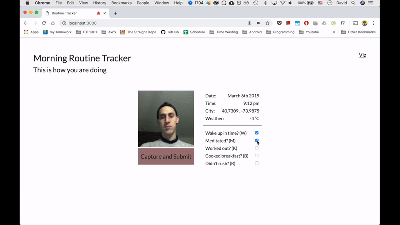
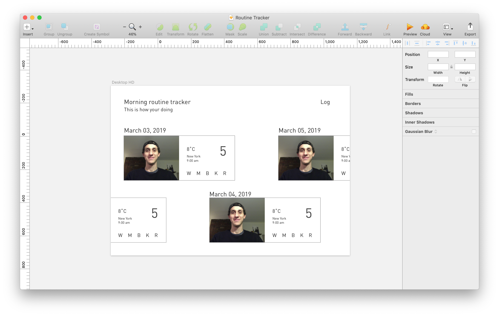
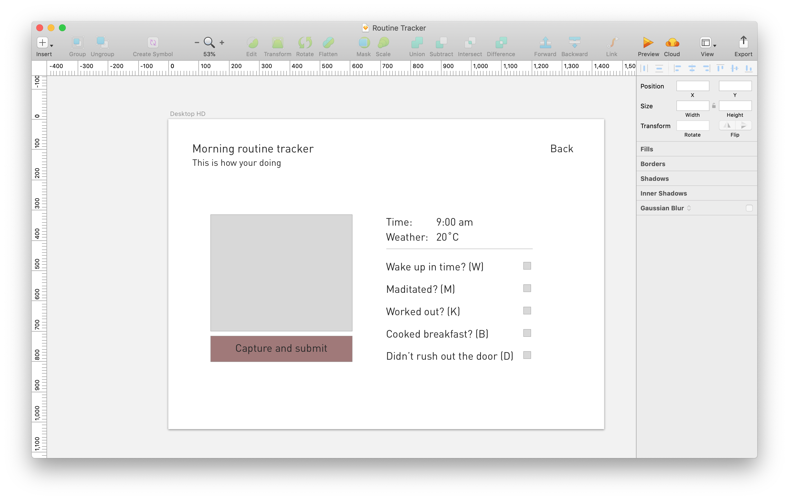
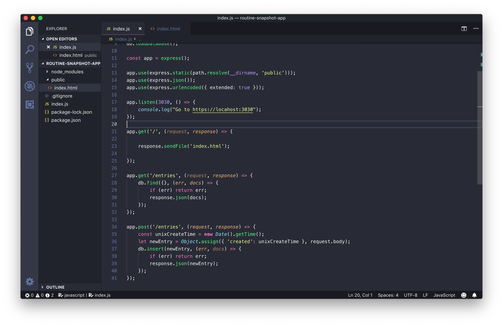
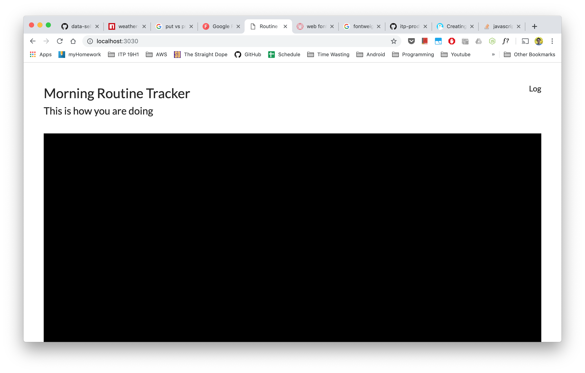
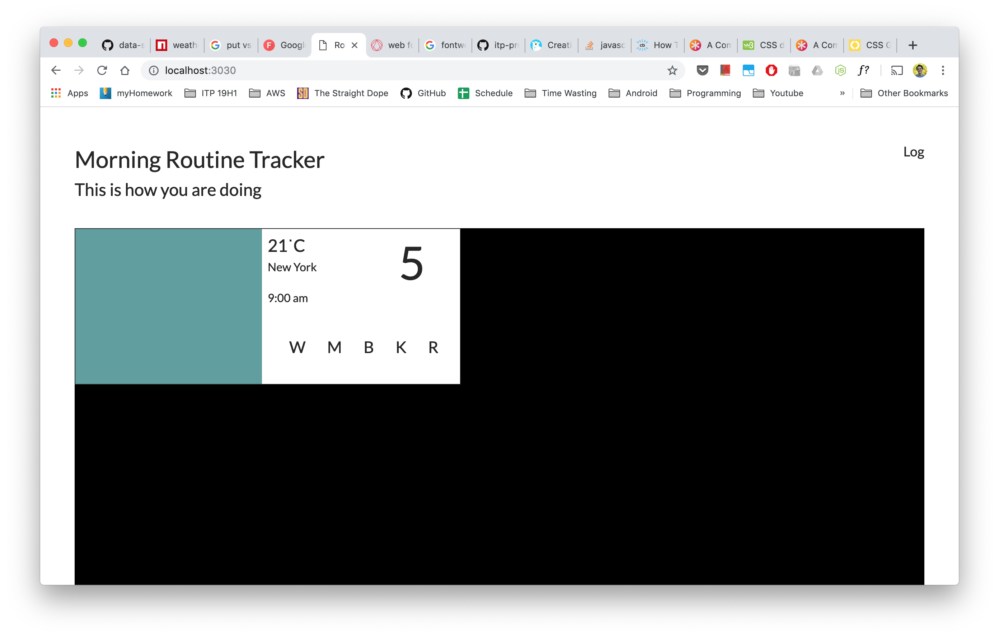
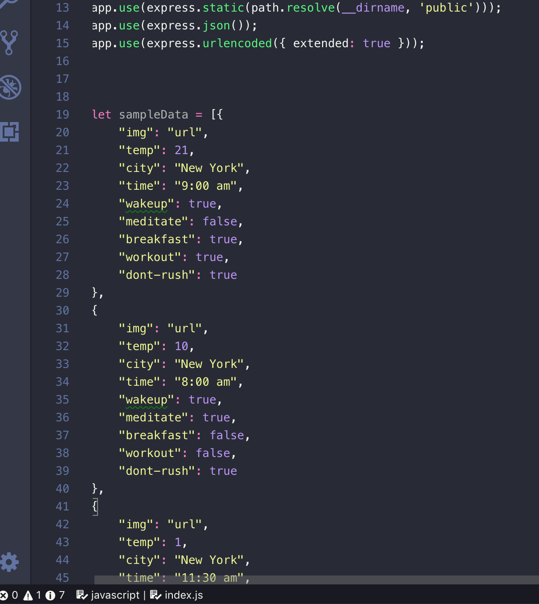

DAVID, AZAR  
QUANT HUMANISTS  
SPRING 2019   
06 03 2019

## Assignment `4`: Daily snapshot and morning routine log
 
This simple fullstack application allows me to keep track of my daily goals by allowing me to record a snapshot of my day.

## Concept

If you think about it, a daily data snapshot can be a great tool for self accountability.

I'm currently experimenting and defining what I want my morning and night routines to involve. I've reading a lot about this and the general knowledge coincides that a good morning and evening routine is necessary for a happy and balanced life. This app will let me see how well I stay on track with my desired habits.

## Design

### Data comes first

Before starting with development or UI design, I need to define the data/info to be collected.

I want to become better at maintaining my morning and evening routines. The things that I'd like to make a habit for myself are:

**Morning routine**

* Wake up in time
* Meditate
* Cook breakfast
* Dont rush out the door
* Light workout

**Evening routine**

* Draw
* Tidy apartment
* Cook light dinner
* Bedtime
* Worked on something exciting?

**Additional to every morning and evening**

* Selfie
* Coordinates (Map???)
* Weather
* Date and time
* Text box for any additional message

There is a [Google Maps Static API](https://developers.google.com/maps/documentation/maps-static/usage-and-billing) that returns an image for any given set of coordinates. It costs, but I might refer back to it in the future.

To sum up, I want to be able to track how I am keeping up with my desired morning and evening habits, as well as adding some additional contextual information to make that content richer.

### Interaction

The actions that I want to be able to perform are:

1. Visualize my results
2. Record a data snapshot

Nice extras for down the road:

* Authenticate (pretty personal stuff in this app)
* Filter the viz view to analyze the data
* Responsive for other screen sizes
* Ranking/point system for encouragement

 

For action #1 (visualize), the relevant elements are:

* Being able to see day and night pairs of data together
* Scroll and explore entries without getting lost (maybe hard to accomplish for now).
* Have a legend of the data in case data blocks are not easy to understand quickly

For action #2 (log), the relevant elements are:

* Easy and direct way of recording your information
* Cancel a data entry

### UI Design

Taking the data and interaction into account, I designed a simple UI in sketch.

Viz view

Log view

After a simple UI was designed, it was time to start with the development.

### Development

Following the lessons learned from the simple-express-app, I started an empty project with:

> $ npm init

and immediately added the .gitnore file.

> $ touch .gitignore

After that, I set up the libraries to be used:

> $ npm install express
> $ npm install nedb

Once the foundation pieces were in the project directory, I built the backend structure with 2 actions in mind:

1. Get the entires
2. Submit a new entry

The frontend is simple but has somewhat complex views for the visualization part.

There are two screens and the data blocks for every entry.

I'll lay the html for the viz view first:

Once that I can see the overall structure and position of the app, Its time to code the data block view.

After hours of trying to get it to work using flex-box and floats, I realized that it was time for me to use CSS Grid.

[Consulting from this website](https://css-tricks.com/snippets/css/complete-guide-grid/)

Tinkered for a while with the CSS and got to this point.

I can simulate the data thanks to NeDB to test the Viz view, and that is exactly what I'll do next.

**Data simulation**

I defined a few sample data blocks in the data as in-memory objects in the index.js express server file, and tested that performing a GET to my desired endpoint returned it.

Moved all html declarations into a new Views.js class and created an index.js frontend file but after finding that the new example app actually splits the views into different files, I refactored my code into that same way.

Worked with the project for a while until I understood my current limitations and adapted the design to something I could make today. That meant getting rid of the night time routine.

**Log View**

Looking at the example app, I see that we have to create a div and insert the canvas/video output there.

Researching some more, I learned about the ReverseGeocoding service that Google offers. It has a price as well so I'll stick with coordinates for now.  

Installed moment.js to get nice dates and used weather-js to pull weather information to the form.

Setup the form controls and connected the services to the views.

The webcam was the last thing that I tested. I quickly learned about the "payload too large" error and scaled down my canvas and data block to 200x200 px. 

Once that everything was connected and the frontend was sending the form data to the backend, I went back and added NeDB back, removing the in-memory simulated data.

Only a few minor adjustments had to be made to bind the data properly. After that, the was ready.

### Result

The app works great. 

When I open the app I'm prompted to record my habits and take a selfie. 

It's quick at doing what it needs to.

On the design side, I think there is much more work to do. It's my first time using a horizontal list and I really liked how it plays with the concept of time.

The data blocks are very abstract. I know that it is not obvious at a first glance what the letters stand for, but since this is an app for personal tracking, I'm the only one using it.

I spent way too much time on it, but I wanted to learn how to make a simple fullstack app from scratch and I actually did.

