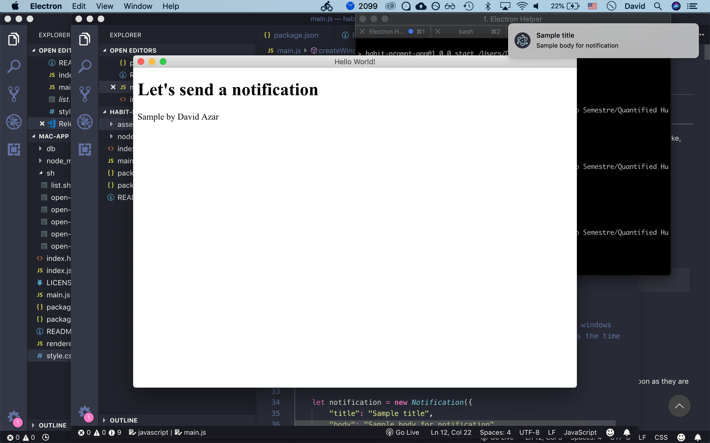

DAVID, AZAR  
QUANT HUMANISTS  
SPRING 2019   
04 25 2019

## Assignment `5`: Daily reminder 
 
 

For this assignment, I want to explore ways of facilitating the logging and collection of data. No matter how fancy a self-tracking app is, if we fail to login and record our data, it's useless.

To keep things simple, I am focusing on a digital prompt. Something that pops when we are working on our computers every day.

### Concept

I want to be very practical with this task. Getting the user into the platform shouldn't be a resource-intensive task, and most of the interaction should be done on the main actions that a user might perform on a self tracking app, such as logging, visualizing, analyzing or exporting data.

The first idea I had was to develop some sort of physical puzzle that forces you to log into the desired platform in order for it to physically unlock the lock in your apartment. Intriguing, sure. But practical? Not so much.

For this reason, I am focusing on creating something non-intrusive and easily adaptable. 

A simple macOS app that prompts you after 2 minutes of opening your laptop to log your morning habits into any desired app. For this exercise, I'll use my morning-habit-app.

### Process

I'll use Electron.js as the framework to create the macOS app. What I want to achieve is a simple "Menu Bar App" that is always present and sends simple notifications to the user, reminding them to perform an action.

#### Sending a notification

After setting up a simple and empty app, my next natural step is to send a notification to the user, so let's do that.

Using the Electron Notification module, I am able to send a simple native notification.

#### Converting the app to a menu bar app

The next step is to make this app always active by making it live in the system menu bar (top of the screen).

[This great guide](https://steemit.com/education/@ryanbaer/getting-started-with-electron-a-basic-menubar-app-part-1) points to some helpful classes resources.

Using the Tray class, I am able to add an icon to the menu bar, but the app is still opened like a regular app, meaning that is appears as an item in the Mac Doc, something I don't like. I'm gonna have to run with his for now but its something I'll come back to afterwards.

#### Adding a sheet for settings below the menu icon

After going though the tutorial linked above, I can set the sheet to be opened below the tray icon at with any wanted size, bounding the app view to the top menu bar.

#### Trigger something at a desired moment (Timer)

Next step is to create a recurrent alarm every day at the same time. Using the vanilla setTimeout/setInterval functions will make everything much more complicated than necessary. I'll use [node-schedule instead](https://www.npmjs.com/package/node-schedule).

I am able to schedule a job every minute, hour or at any specific time. Now, its time to add some basic controllers on the app sheet. For now, i'll just give the opportunity to select the time to be reminded at, and this will happen every day.

#### Final touches.

The UI is super simple. I added a text field to specify the URL to be opened when clicking on the notification.

### Conclusions

The app works as intended. I like how the user has a choice of clicking or not clicking the notification in order to log the info, instead of it opening the website for you at a bad time. Adding a snooze function would sure be useful for future uses.

